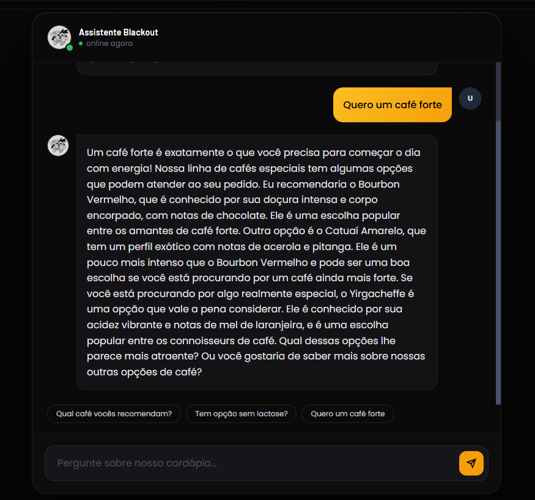

# ☕ The Machine — Blackout Coffee Management System & AI

> **Trabalho de Conclusão de Curso (TCC)**
> Curso: Análise e Desenvolvimento de Sistemas (ADS)
> Desenvolvedor: André Lumertz Martins

O **The Machine** é um ecossistema digital integrado desenvolvido para o **Blackout Café** (Porto Alegre/RS). A aplicação une um sistema de gestão administrativa tradicional (CRUD de produtos e relatórios) a um motor de Inteligência Artificial Generativa baseado em **RAG (Retrieval-Augmented Generation)**, atuando como um atendente especializado no cardápio e em cafés especiais.

---

## 🎯 Sobre o Projeto

Este projeto demonstra a viabilidade de integrar sistemas comerciais em **PHP** com serviços modernos de IA em **Python (FastAPI)** dentro de um único ambiente conteinerizado, otimizando o uso de recursos em nuvem e oferecendo inferência de baixíssima latência para o usuário final.

---

## 🚀 Funcionalidades Principais

- **☕ Sommelier de Café (IA):** Chatbot especialista integrado que consome o PDF do cardápio técnico para tirar dúvidas, sugerir harmonizações e métodos de preparo.
- **🛡️ Filtro de Intenções Furtivo:** Camada de segurança no front-end e back-end que bloqueia escopos fora de contexto (programação, política) e redireciona automaticamente intenções de compra/pagamento para canais humanos (WhatsApp/E-mail).
- **💻 Painel Administrativo (Dashboard):** Sistema completo para gerenciamento da operação da cafeteria e controle de produtos (CRUD).
- **📄 Relatórios Gerenciais:** Módulo de exportação de dados administrativos estruturados em formato PDF (via Composer).
- **⚡ Inferência em Tempo Real:** Motor de IA alimentado pela infraestrutura da Groq LPU, respondendo em milissegundos.

---

## 🛠️ Tecnologias e Arquitetura

### Core & Painel Administrativo

- **PHP 8.2 & MySQL:** Lógica de negócio, sessão de segurança do administrador e persistência dos dados dos produtos.
- **TiDB Cloud:** Banco de dados em nuvem compatível com o protocolo MySQL, utilizado como banco de produção (ver seção [Hospedagem e Deploy](#-hospedagem-e-deploy)).
- **Tailwind CSS:** Interface responsiva com estética moderna, minimalista e *dark mode*.
- **Composer:** Gerenciamento de dependências e bibliotecas para geração de arquivos PDF.

### Inteligência Artificial & RAG Otimizado

- **FastAPI & Uvicorn (Python 3):** Microserviço assíncrono responsável por expor a API do Chatbot na porta `8001`.
- **LlamaIndex Core:** Framework de orquestração do RAG. Configurado de forma leve com indexação de vetores nativa em memória RAM (`VectorStoreIndex`), eliminando a necessidade de banco de dados vetorial físico no servidor.
- **MockEmbedding:** Injeção de embedding mockado para evitar o download de pacotes locais pesados de Deep Learning (como PyTorch/HuggingFace), mantendo o contêiner extremamente leve.
- **Groq LPU (Llama 3.3 70B):** Processamento cognitivo em nuvem por meio de chaves de API, garantindo performance extrema.

---

## 📁 Estrutura do Projeto

Abaixo está a organização dos arquivos e diretórios do ecossistema:

```text
THE_MACHINE/
├── css/                  # Estilizações globais da aplicação (Tailwind)
├── documents/            # Base de conhecimento do RAG
│   └── blackout_cafes_especiais.pdf  # PDF técnico consumido pela IA
├── img/                  # Ativos visuais (logos, mídias e backgrounds)
├── js/                   # Scripts de interatividade do front-end
├── src/
│   ├── Controlador/      # Pontes de integração (ex: chat-bridge.php)
│   ├── Modelo/           # Lógica de manipulação de dados
│   └── conexao-bd.php    # Configuração e persistência com o MySQL
├── admin.php             # Dashboard principal do administrador
├── app.py                # Microserviço em Python (FastAPI + LlamaIndex)
├── cadastrar-produto.php # Módulo de inserção do CRUD
├── composer.json         # Dependências PHP (Dompdf/FPDF)
├── conteudo-pdf.php      # Estruturação de dados para exportação
├── Dockerfile            # Receita de build híbrido para o Render
├── editar-produto.php    # Módulo de atualização do CRUD
├── excluir-produto.php   # Módulo de remoção do CRUD
├── gerador-pdf.php       # Script de disparo e download de relatórios
├── index.php             # Página institucional e interface do Chatbot
├── login.php             # Tela de autenticação restrita do painel
├── logout.php            # Encerramento seguro de sessão do admin
└── requirements.txt      # Dependências de IA para o ambiente Python
```

---

## ☁️ Hospedagem e Deploy

O sistema **The Machine** utiliza uma arquitetura moderna e otimizada para a nuvem. O banco de dados escolhido para o projeto foi o **MySQL**.

Para viabilizar a hospedagem 100% gratuita em produção, a aplicação foi dividida: o servidor web (PHP) e o motor de inteligência artificial (Python) ficam hospedados na plataforma **Render**. Como o Render não possui banco de dados MySQL nativo em seu plano gratuito, foi integrado o **TiDB Cloud**.

O TiDB Cloud é um banco de dados em nuvem de última geração que possui compatibilidade total (nativa) com o protocolo do MySQL. Na prática, para o código PHP, ele funciona exatamente como um MySQL tradicional, mas rodando de forma distribuída na nuvem.

A estratégia de desenvolvimento segue o padrão de mercado:

- **Ambiente de Desenvolvimento (Local):** é utilizado um banco MySQL local rodando na própria máquina (via XAMPP ou Docker) para testes rápidos e desenvolvimento sem dependência de internet.
- **Ambiente de Produção (Nuvem/Online):** a aplicação do Render conecta-se remotamente ao TiDB Cloud, garantindo que o painel administrativo, o login e o CRUD de produtos funcionem online para qualquer usuário de forma segura e performática.

| Camada | Ambiente Local (Dev) | Ambiente de Produção |
|---|---|---|
| Servidor Web (PHP) | `php -S 127.0.0.1:80` ou Docker | Render |
| Motor de IA (Python) | `python app.py` (porta 8001) | Render |
| Banco de Dados | MySQL local (XAMPP/Docker) | TiDB Cloud (compatível com MySQL) |

---

## 📸 Demonstração do Sistema

### Interface do Chatbot Especialista (Dark Mode)

O assistente integrado utiliza processamento cognitivo em nuvem para responder sobre grãos e métodos do cardápio em tempo real.



---

## 🔧 Como Executar o Projeto em Casa (Localhost)

Para rodar este projeto localmente, você pode escolher o método manual instalando os runtimes na sua máquina ou utilizar o Docker.

### 📋 Pré-requisitos

- **Chave de API da Groq:** Crie uma conta gratuita no Groq Cloud Console e gere uma API Key.
- Ambiente local com **PHP 8.2+** e **Python 3.10+** instalado OU o **Docker** configurado.

### 🚀 Método 1: Execução Manual (Sem Docker)

#### Passo 1: Configurar a Inteligência Artificial (Python)

Abra o terminal na raiz do projeto e instale as dependências da IA:

```bash
pip install -r requirements.txt
```

Crie um arquivo chamado `.env` na raiz do projeto e insira a sua chave da Groq:

```
GROQ_API_KEY=sua_chave_da_groq_aqui
```

Inicie o servidor do motor de IA:

```bash
python app.py
```

A API do chatbot estará rodando e aguardando requisições em `http://127.0.0.1:8001`.

#### Passo 2: Configurar o Banco de Dados (MySQL)

1. Crie um banco de dados MySQL local chamado `blackout_cafe`.
2. Importe a estrutura de tabelas necessária (verifique os mapeamentos no arquivo `src/conexao-bd.php`).

#### Passo 3: Configurar o Servidor Web (PHP)

Certifique-se de que o Composer instalou as dependências de PDF. Caso não, execute:

```bash
composer install
```

Inicie o servidor embutido do PHP apontando para a raiz do projeto (abra um novo terminal para manter o processo do Python ativo):

```bash
php -S 127.0.0.1:80
```

Acesse `http://127.0.0.1` no seu navegador para interagir com o site e o chat de IA de forma integrada.

### 🐳 Método 2: Execução via Docker (Ambiente Completo)

O projeto já conta com um Dockerfile híbrido configurado para orquestrar os dois ambientes simultaneamente de maneira automatizada.

Construa a imagem do contêiner local:

```bash
docker build -t the-machine .
```

Execute o contêiner passando a sua chave da Groq como variável de ambiente no runtime:

```bash
docker run -d -p 80:80 -e GROQ_API_KEY="sua_chave_da_groq_aqui" --name the-machine-app the-machine
```

Acesse `http://localhost` no seu navegador e o sistema estará 100% operacional (Site, CRUD, Banco de dados local e IA integrados em segundo plano).